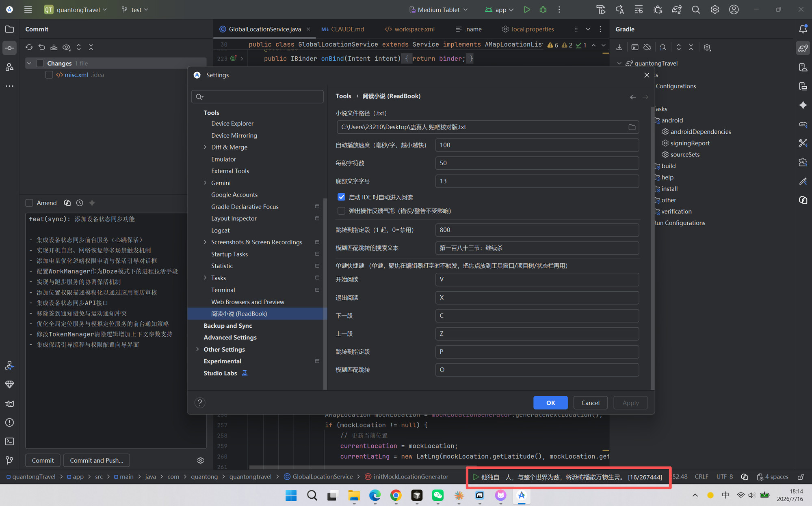
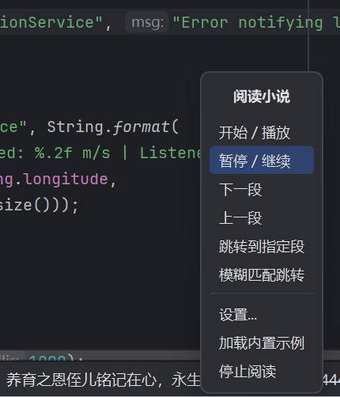
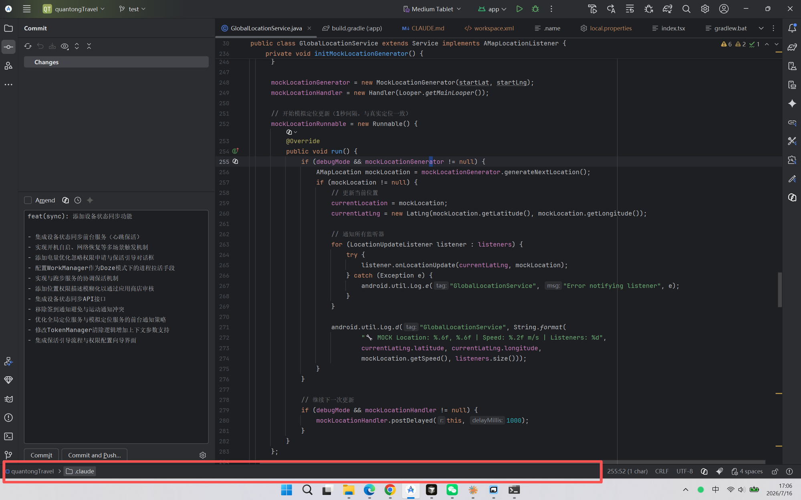

# ReadBook · JetBrains 底部状态栏读小说插件

在 **JetBrains 全家桶**（Android Studio / IntelliJ IDEA / PyCharm / WebStorm / GoLand …）的**底部状态栏**里读小说，边写代码边摸鱼。小说文字直接显示在状态栏，一段一段自动滚动，老板走过来一键隐藏。

> 使用 VSCode / Cursor 等微软系编辑器的同学请移步原版扩展：
> **https://github.com/GuangLang/readbook** （本项目即参考它移植到 JetBrains 平台）。



---

## 一、这个插件能做什么

- **底部状态栏阅读**：小说按段落切分（默认每段 50 字），逐段显示在 IDE 最底部的状态栏，鼠标悬停可看完整段落。
- **自动播放 / 暂停**：左键点击状态栏即可开始或暂停；播放速度按“毫秒/字 × 段字数”自动计算，短段快、长段慢，接近自然阅读节奏。
- **一键隐藏**：右键菜单「隐藏」把小说从状态栏彻底移除（老板键），按开始键或菜单再让它出现。
- **手动翻页 / 跳转**：上一段、下一段、跳到指定段号、按关键字模糊匹配跳转（如 `第一百八十三节`）。
- **单键快捷键**：默认 `R` 开始、`W` 退出、`E` 下一段、`Q` 上一段、`P` 跳指定段、`O` 模糊跳转，全部可在设置里改。
  - 单键**只在焦点不在编辑器时生效**，所以你在代码里正常打字完全不受影响；想翻页时把焦点点到工具窗口 / 项目树 / 状态栏再按键即可。
- **自动记忆进度**：翻页 / 退出都会记住位置，跨重启、跨项目下次接着上次读；启动时自动加载上次的小说。

### 支持的 IDE

只依赖 IntelliJ 平台通用 API，理论上适用于**所有基于 IntelliJ 平台的 IDE**：Android Studio、IntelliJ IDEA（Community / Ultimate）、PyCharm、WebStorm、GoLand、CLion、PhpStorm、RubyMine、Rider、DataGrip 等。兼容构建号 `233`（2023.3）~ `252.*`。

---

## 二、在 IDE 里安装使用

### 1. 下载

前往本仓库的 **[Releases](https://github.com/jialiangh/readbook/releases)** 页面，下载可直接使用的 `readbook-jet-x.y.z.jar`。

### 2. 安装

`Settings/Preferences → Plugins → ⚙（右上齿轮）→ Install Plugin from Disk…` → 选择下载的 `.jar` → 重启 IDE。

安装后，IDE **右下角状态栏**会出现一个图标 + “阅读小说：未加载”。

### 3. 加载小说并阅读

1. **右键**状态栏上的插件项 → 弹出操作菜单：

   

   - **开始 / 暂停**：开始自动播放，或在播放/暂停间切换（未加载时会先载入内置示例）。
   - **隐藏**：停止并把小说从状态栏隐藏（记住当前位置）。
   - **下一段 / 上一段**：手动翻页。
   - **跳转到指定段 / 模糊匹配跳转**：跳到设置里配置的段号 / 关键字。
   - **设置**：打开本插件的设置面板。
   - **加载内置示例**：载入自带的示例小说，先体验一下。

2. 要读**自己的小说**：右键 →「设置」→ 在「小说文件路径」里填入你的 `.txt` 文件路径 → OK，插件会立即加载。

3. **左键点击**状态栏 = 开始 / 暂停；用快捷键 `E`/`Q` 翻页、`W` 隐藏、`R` 重新开始。

> 状态栏位置示意（红框处即底部状态栏）：
>
> 

---

## 三、设置项说明

`Settings/Preferences → Tools → 阅读小说 (ReadBook)`（或右键菜单「设置」）：

| 设置项 | 作用 |
| --- | --- |
| **小说文件路径（.txt）** | 要阅读的小说文本文件路径。填好后立即加载；留空则不自动加载。 |
| **自动播放速度（毫秒/字，越小越快）** | 自动翻页的节奏。每段等待时间 = 速度 × 该段字数（最少 200ms）。默认 600（约 30 秒/段），数值越小翻得越快。 |
| **每段字符数** | 每段显示多少字，默认 50（大多数显示器状态栏刚好放得下）。改动后会按新长度重新切段。 |
| **底部文字字号** | 状态栏里小说文字的字号，默认 13。 |
| **启动 IDE 时自动进入阅读** | 勾选后，打开 IDE 自动开始播放（需已加载过小说）。 |
| **弹出操作反馈气泡** | 是否在右下角弹“已开始/已暂停/已加载”等提示。默认关闭以免打扰；**错误和警告不受此开关影响**。 |
| **跳转到指定段（1 起，0=禁用）** | 按“跳转到指定段”键时要跳到的段号（从 1 开始）。填 0 表示禁用。 |
| **模糊匹配跳转的搜索文本** | 按“模糊匹配跳转”键时要查找的关键字（如 `第一百八十三节`）。会在所有段里找第一个匹配的段跳过去。 |
| **单键快捷键** | 开始阅读 / 退出阅读 / 下一段 / 上一段 / 跳转到指定段 / 模糊匹配跳转 六个动作的单键绑定，默认 `R`/`W`/`E`/`Q`/`P`/`O`，可自定义。**只在焦点不在编辑器（文本输入框）时触发**，因此不会干扰你在代码里打字。 |


---

## 四、自己动手（开发 / 从源码构建）

想改代码或自己打包，需要 **JDK 17**。

```bash
git clone https://github.com/jialiangh/readbook.git
cd readbook

# 若本机装了 Gradle（仓库未附带 gradle-wrapper.jar）
gradle wrapper --gradle-version 8.10.2

# 在沙箱 IDE 里调试运行
./gradlew runIde

# 打包插件，产物在 build/distributions/*.zip（或 .jar）
./gradlew buildPlugin
```

> 直接用 IntelliJ IDEA `Open` 本项目根目录也行，IDE 会用内置 Gradle 自动导入，无需手动准备 wrapper。

### 项目结构

```
src/main/kotlin/com/jialiangh/readbook/
  ReaderState.kt                    阅读状态枚举
  ReadBookSettings.kt               配置 + 进度持久化（PersistentStateComponent）
  NovelReaderService.kt             核心：加载/切段/播放/翻页/跳转/存档
  ReadBookStatusBarWidget.kt        底部状态栏 widget（显示文字 + 右键菜单）
  ReadBookStatusBarWidgetFactory.kt widget 工厂
  ReadBookKeyDispatcher.kt          焦点感知的单键分发器
  ReadBookActions.kt                Tools 菜单动作
  ReadBookConfigurable.kt           设置界面
  ReadBookStartupActivity.kt        启动自动加载
src/main/resources/
  META-INF/plugin.xml               插件描述与扩展点注册
  novels/sample.txt                 内置示例小说
```

### 技术要点

- 状态栏用 `CustomStatusBarWidget` + `JLabel`，右键弹窗用平台原生 `JBPopupFactory + ActionGroup`（原生 Swing 菜单在 IDE 状态栏里点击事件会被吞掉）。
- 单键通过 `IdeEventQueue.EventDispatcher` 全局拦截，仅当焦点不在编辑器/文本框时才生效，从根源避开与打字的冲突（对应 VSCode 版的 `!inputFocus`）。
- 配置与进度用应用级 `PersistentStateComponent` 存储，跨重启、跨项目保留。

---

## License

[MIT](LICENSE) © 2026 jialiangh

参考自 [GuangLang/readbook](https://github.com/GuangLang/readbook)（VSCode 版）。
